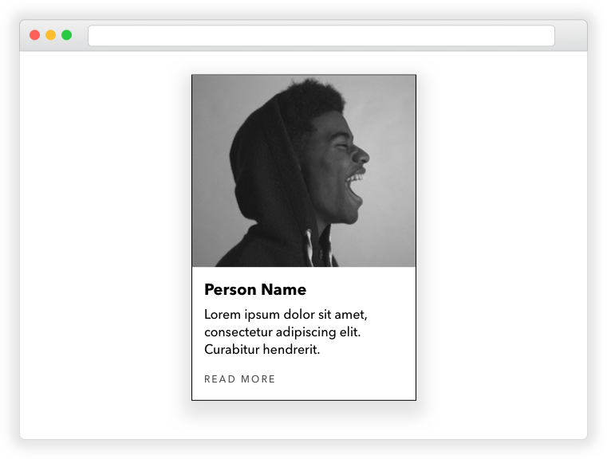

# Build a Card UI Element

### Getting Started

1. Fork this repo and `git clone` it down to your computer
1. When you're finished or when time is up, push your work to your remote repo, and file a Pull Request

---

### Requirements

### Part 1

The "card" is a common user interface element that you will see on many webpages. A designer has given you one to build:

Learn more about this [ubiquitous UI element here](https://www.eleken.co/blog-posts/card-ui-examples-and-best-practices-for-product-owners).

### Part 2: Structure

Work through these steps:

1. Create a wireframe of the card ([read about wireframing](https://webdesign.tutsplus.com/articles/a-beginners-guide-to-wireframing--webdesign-7399))
1. Create an outline for your HTML from your wireframe
1. Build out the skeleton HTML inside an `index.html` file
1. Fill in the `body` element with the HTML for your card

> Note, the image comes from [Unsplash](https://unsplash.com/). You may find and use a similar image instead.

### Part 3: Styling

Write the CSS rules in an external stylesheet to style the card so that it looks like the one in the mock-up.

Note, you may have to research some declarations! Here are three really good CSS
references:

1. [cssreference.io](https://cssreference.io/)
1. [MDN CSS Properties
   Reference](https://developer.mozilla.org/en-US/docs/Web/CSS/CSS_Properties_Reference)
1. [Codrops CSS Reference](https://tympanus.net/codrops/css_reference/)

### Bonus: Naming CSS classes

Knowing what to name your CSS classes is tricky. You want something memorable and semantic, but you also don't want to waste a lot of time coming up with names for things. Because this is such a common problem, developers have come up with conventions for how they name their CSS classes. One of the best and most used conventions is called **BEM**, which stands for block, element, modifier.

Read the following two blog posts about BEM and then update your card to use the BEM syntax.

1. [MindBEMding – getting your head 'round BEM syntax](https://csswizardry.com/2013/01/mindbemding-getting-your-head-round-bem-syntax/)
1. [BEM 101](https://css-tricks.com/bem-101/)
